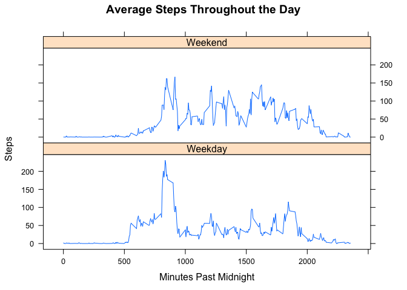

# Reproducible Research: Peer Assessment 1


## Loading and preprocessing the data

Let's read the data in.

```r
file <- read.csv("activity.csv")
```

## What is the mean total number of steps taken per day?

Let's find the total number of steps taken on each day and plot a histogram.

```r
steps <- aggregate(file$steps, list(date = file$date), sum)
head(steps)
```

```
##         date     x
## 1 2012-10-01    NA
## 2 2012-10-02   126
## 3 2012-10-03 11352
## 4 2012-10-04 12116
## 5 2012-10-05 13294
## 6 2012-10-06 15420
```

```r
hist(steps$x, xlab = "Steps per day", main = "Histogram of Steps per Day")
```

 

Now let's find the mean and median number of steps taken per day.

```r
mean(steps$x, na.rm = TRUE)
```

```
## [1] 10766.19
```

```r
median(steps$x, na.rm = TRUE)
```

```
## [1] 10765
```

## What is the average daily activity pattern?

Let's find the average number of steps taken for each 5 minute interval across all days and plot it as a line graph.

```r
stepsPerDay <- aggregate(file$steps, list(min = file$interval), mean, na.rm = TRUE)
plot(stepsPerDay$min, stepsPerDay$x, type = "l", xlab = "Minutes Past Midnight", ylab = "Steps", main = "Average Steps Throughout the Day")
```

 

Let's find the 5 minute interval which, on average, contains the most number of steps. 

```r
stepsPerDay[stepsPerDay$x == max(stepsPerDay$x),]
```

```
##     min        x
## 104 835 206.1698
```
This matches what we see in the line graph!

## Imputing missing values

How many values are there in this dataset and how many are missing (i.e., NA)?

```r
totalValues <- nrow(file); totalValues
```

```
## [1] 17568
```

```r
missingValues <- length(file[is.na(file$steps),1]); missingValues
```

```
## [1] 2304
```

```r
missingValues/totalValues
```

```
## [1] 0.1311475
```
 
Let's impute the missing values based on the average for that particular 5 minute interval.

```r
imputedFile <- file
for(i in 1:nrow(imputedFile)) {
    if(is.na(imputedFile[i, 1])) {
        minTracker <- imputedFile[i, 3]
        imputedFile[i, 1] <- stepsPerDay[stepsPerDay$min == minTracker, 2]
    }
}
```

Let's make sure there are no NA values in the imputed dataset.

```r
head(imputedFile)
```

```
##       steps       date interval
## 1 1.7169811 2012-10-01        0
## 2 0.3396226 2012-10-01        5
## 3 0.1320755 2012-10-01       10
## 4 0.1509434 2012-10-01       15
## 5 0.0754717 2012-10-01       20
## 6 2.0943396 2012-10-01       25
```

```r
missingValues2 <- length(imputedFile[is.na(imputedFile$steps),1]); missingValues2
```

```
## [1] 0
```

Now let's re-calculate the total number of steps taken each day and graph it in a histogram. We'll also calculate the mean and median total number of steps taken per day.

```r
imputedSteps <- aggregate(imputedFile$steps, list(date = imputedFile$date), sum)
hist(imputedSteps$x, xlab = "Steps per day", main = "Histogram of Steps per Day (with Imputation)")
```

 

```r
mean(imputedSteps$x)
```

```
## [1] 10766.19
```

```r
median(imputedSteps$x)
```

```
## [1] 10766.19
```

Note that the mean number of steps per day did not change after imputation because we imputated with the mean number of steps for each 5 minute interval. This sums up to the mean number of steps per day if we calculate the total number of steps per day for those days with imputation.

The median number of steps per day did change slightly and now is the same as the mean number of steps per day. This isn't surprisingly, though, because we had 8 days with NA values. Therefore, these 8 days all have the same total steps after imputation, which makes it more likely that the median will equal this value.

## Are there differences in activity patterns between weekdays and weekends?

Let's first use the imputed data to factor out specific dates based on whether it is a weekday or weekend. Then we will find the average steps per 5 minute interval (reminder we did this before without imputation) based on weekday/weekend.


```r
imputedFile$Day <- weekdays(as.POSIXlt(imputedFile$date))
imputedFile$DayType <- "NA"
imputedFile$DayType[which(imputedFile$Day == "Saturday" | imputedFile$Day == "Sunday")] = "Weekend"
imputedFile$DayType[which(imputedFile$Day != "Saturday" & imputedFile$Day != "Sunday")] = "Weekday"
imputedFile$DayType <- as.factor(imputedFile$DayType)
imputedStepsPerDay <- aggregate(imputedFile$steps, list(min = imputedFile$interval, Day = imputedFile$DayType), mean)
```

Now let's plot daily activity patterns between weekdays and weekends to see if there is a difference.

```r
plot(imputedStepsPerDay$min, imputedStepsPerDay$x, type = "n", xlab = "Minutes Past Midnight", ylab = "Steps", main = "Average Steps Throughout the Day")
lines(imputedStepsPerDay$min[which(imputedStepsPerDay$Day == "Weekday")], imputedStepsPerDay$x[which(imputedStepsPerDay$Day == "Weekday")], col = "blue")
lines(imputedStepsPerDay$min[which(imputedStepsPerDay$Day == "Weekend")], imputedStepsPerDay$x[which(imputedStepsPerDay$Day == "Weekend")], col = "red")
legend("topright", col = c("blue", "red"), legend = c("Weekday", "Weekend"), lty = c(1,1))
```

 

If we want to plot the data in two separate panels, we can do that too.

```r
library(lattice)
```

```
## Warning: package 'lattice' was built under R version 3.1.3
```

```r
xyplot(x ~ min | Day, data = imputedStepsPerDay, type = "l", layout = c(1,2), xlab = "Minutes Past Midnight", ylab = "Steps", main = "Average Steps Throughout the Day")
```

 

It looks like there are differences in activity on weekdays compared to weekends.
